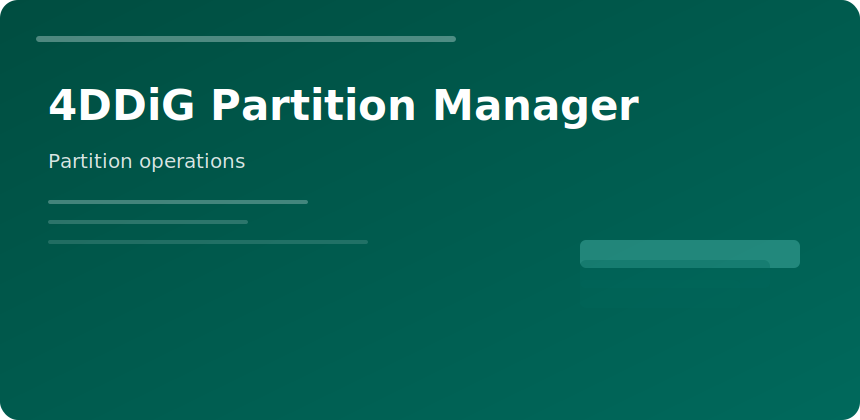

  

  

# 4DDiG Partition Manager

**Category:** storage layout  
**OS:** Windows  

---

Manage partitions when you outgrow a C: drive, dual-boot, or migrate HDD → SSD without reinstalling Windows.

### Supported tasks

- Extend/shrink NTFS volumes
- Merge adjacent partitions
- Clone disk to disk
- Convert MBR/GPT where applicable
- Surface S.M.A.R.T. basics

### Before you click Apply

| Step | Reason |
|------|--------|
| Image backup | Rollback if power loss mid-op |
| Close apps | Filesystem locks block moves |
| Note disk order | BIOS boot depends on active flag |

### Not a substitute for

Full forensic recovery—pair with file recovery tools if partitions were deleted accidentally.

4ddig partition manager disk resize clone windows storage tool
